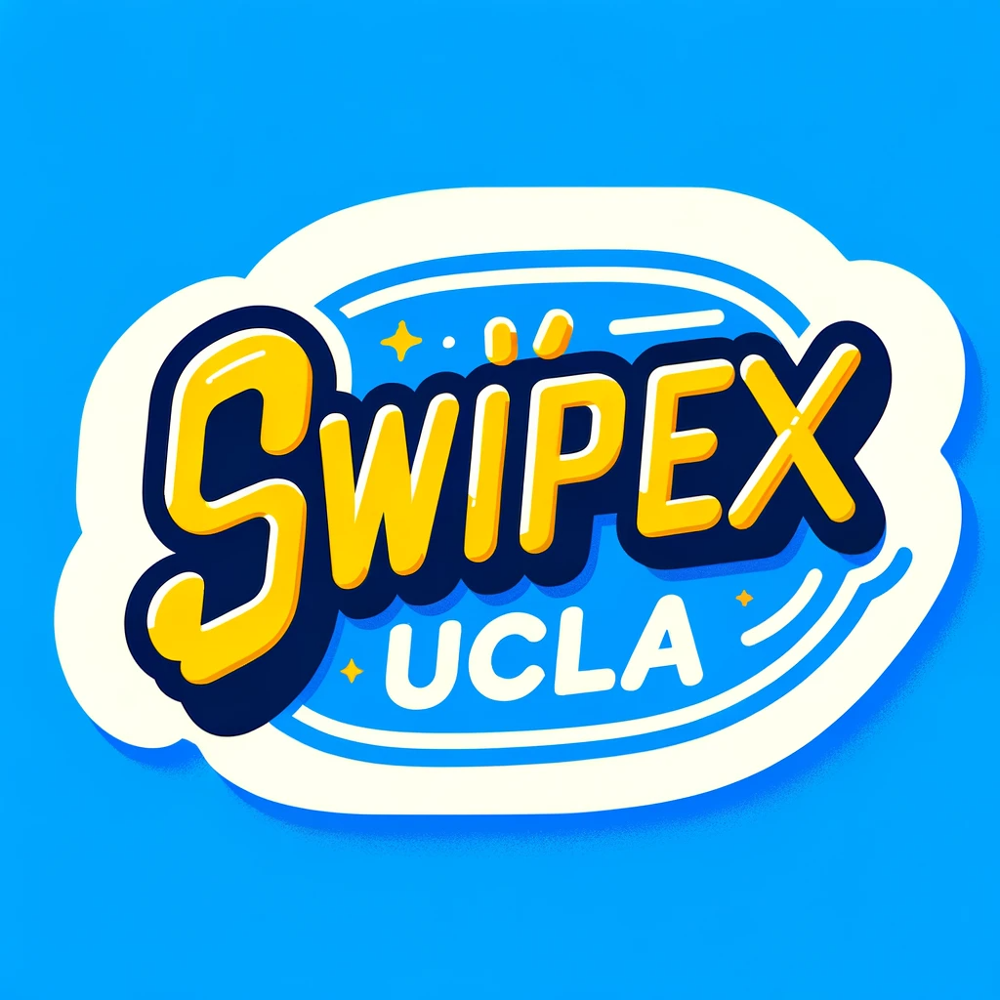

<!-- Improved compatibility of back to top link: See: https://github.com/othneildrew/Best-README-Template/pull/73 -->
<a name="readme-top"></a>
<!--
*** Thanks for checking out the Best-README-Template. If you have a suggestion
*** that would make this better, please fork the repo and create a pull request
*** or simply open an issue with the tag "enhancement".
*** Don't forget to give the project a star!
*** Thanks again! Now go create something AMAZING! :D
-->

<!-- PROJECT SHIELDS -->
<!--
*** I'm using markdown "reference style" links for readability.
*** Reference links are enclosed in brackets [ ] instead of parentheses ( ).
*** See the bottom of this document for the declaration of the reference variables
*** for contributors-url, forks-url, etc. This is an optional, concise syntax you may use.
*** https://www.markdownguide.org/basic-syntax/#reference-style-links
-->
[![Contributors][contributors-shield]][contributors-url]
[![Forks][forks-shield]][forks-url]
[![Stargazers][stars-shield]][stars-url]
[![Issues][issues-shield]][issues-url]
[![MIT License][license-shield]][license-url]
[![LinkedIn][linkedin-shield]][linkedin-url]

<!-- PROJECT LOGO -->
<br />
<div align="center">
  <a href="https://github.com/github_username/repo_name">
    
  </a>

<h3 align="center">SwipeX</h3>

  <p align="center">
    An innovative platform for UCLA students to exchange meal swipes.
    <br />
    <a href="https://github.com/github_username/repo_name"><strong>Explore the docs »</strong></a>
    <br />
    <br />
    <a href="https://github.com/github_username/repo_name">View Demo</a>
    ·
    <a href="https://github.com/Markliniubility/UCLA-Swipes-Exchange/issues">Report Bug</a>
    ·
    <a href="https://github.com/Markliniubility/UCLA-Swipes-Exchange/issues">Request Feature</a>
  </p>
</div>


<!-- TABLE OF CONTENTS -->
<details>
  <summary>Table of Contents</summary>
  <ol>
    <li>
      <a href="#about-the-project">About The Project</a>
      <ul>
        <li><a href="#built-with">Built With</a></li>
      </ul>
    </li>
    <li>
      <a href="#getting-started">Getting Started</a>
      <ul>
        <li><a href="#prerequisites">Prerequisites</a></li>
        <li><a href="#installation">Installation</a></li>
      </ul>
    </li>
    <li><a href="#usage">Usage</a></li>
    <li><a href="#roadmap">Roadmap</a></li>
    <li><a href="#contributing">Contributing</a></li>
    <li><a href="#license">License</a></li>
    <li><a href="#contact">Contact</a></li>
    <li><a href="#acknowledgments">Acknowledgments</a></li>
  </ol>
</details>


<!-- ABOUT THE PROJECT -->
## About The Project

[![Product Name Screen Shot][product-screenshot]](https://github.com/Markliniubility/UCLA-Swipes-Exchange)

UCLA Swipes Exchange is a platform designed for UCLA students to easily and securely exchange meal swipes. This project aims to provide a convenient way for students to maximize their meal plan benefits.


<p align="right">(<a href="#readme-top">back to top</a>)</p>


### Built With
[![React][React.js]][React-url]
[![Flask][Flask.js]][Flask-url]
[![MongoDB][MongoDB.com]][MongoDB-url]

<p align="right">(<a href="#readme-top">back to top</a>)</p>


<!-- GETTING STARTED -->
## Getting Started

To get a local copy up and running follow these simple steps.

### Prerequisites

This project requires Node.js, mongodb and Python installed on your machine.

### Installation

1. Clone the repo
   ```sh
   git clone git clone https://github.com/Markliniubility/UCLA-Swipes-Exchange.git
   ```
2. Install NPM packages for Frontend
   ```sh
   cd frontend
   npm install
   ```
3. Setupt the Backend
   ```sh
   cd ../backend
   pip install -r requirements.txt
   ```
4. Check the Databse
    ```sh
    mongod
    mongosh
    ```

<p align="right">(<a href="#readme-top">back to top</a>)</p>


<!-- USAGE EXAMPLES -->
## Usage

Refer to the User Manual section below for detailed instructions on how to use the UCLA Swipes Exchange platform.

_For More Information, please refer to the [User Manual](https://example.com)_

<p align="right">(<a href="#readme-top">back to top</a>)</p>


<!-- ROADMAP -->
## Roadmap

- [X] Epic - User Management
- [X] Epic - Swipe Listings
- [X] Epic - Order Matching and Fulfillment
- [X] Epic - Messaging and Support
- [X] Epic - Platform Administration
- [X] Technical Epic - Maintain a Good Code Pattern

See the [open issues](https://github.com/Markliniubility/UCLA-Swipes-Exchange/issues) for a full list of proposed features (and known issues).

<p align="right">(<a href="#readme-top">back to top</a>)</p>


<!-- CONTRIBUTING -->
## Contributing

Contributions are what make the open source community such an amazing place to learn, inspire, and create. Any contributions you make are **greatly appreciated**.

If you have a suggestion that would make this better, please fork the repo and create a pull request. You can also simply open an issue with the tag "enhancement".
Don't forget to give the project a star! Thanks again!

1. Fork the Project
2. Create your Feature Branch (`git checkout -b feature/AmazingFeature`)
3. Commit your Changes (`git commit -m 'Add some AmazingFeature'`)
4. Push to the Branch (`git push origin feature/AmazingFeature`)
5. Open a Pull Request

<p align="right">(<a href="#readme-top">back to top</a>)</p>

<!-- LICENSE -->
## License

Distributed under the MIT License. See `LICENSE.txt` for more information.

<p align="right">(<a href="#readme-top">back to top</a>)</p>


<!-- CONTACT -->
## Contact

Project Link: [https://github.com/Markliniubility/UCLA-Swipes-Exchange/tree/readme](https://github.com/Markliniubility/UCLA-Swipes-Exchange/tree/readme)

<p align="right">(<a href="#readme-top">back to top</a>)</p>


<!-- ACKNOWLEDGMENTS -->
## Acknowledgments

* [Jeffrey, Lorenzo, Mark, Simon, Tony, Xiaoyang]() - For their invaluable contributions to the project.
* [React, Nodejs, Flask,  Mongodb]() - For providing essential tools or libraries that made the project possible.
* [UCLA Computer Science Department](https://link-to-organization.com) - For their support, be it technical, financial, or moral.
* [Maged Elaasar, Haoran Ma, Kevin Antony	]() - For their guidance and advice throughout the development process.


<p align="right">(<a href="#readme-top">back to top</a>)</p>


<!-- MARKDOWN LINKS & IMAGES -->
<!-- https://www.markdownguide.org/basic-syntax/#reference-style-links -->
[contributors-shield]: https://img.shields.io/github/contributors/Markliniubility/UCLA-Swipes-Exchange.svg?style=for-the-badge
[contributors-url]: https://github.com/Markliniubility/UCLA-Swipes-Exchange/graphs/contributors
[forks-shield]: https://img.shields.io/github/forks/Markliniubility/UCLA-Swipes-Exchange.svg?style=for-the-badge
[forks-url]: https://github.com/Markliniubility/UCLA-Swipes-Exchange/network/members
[stars-shield]: https://img.shields.io/github/stars/Markliniubility/UCLA-Swipes-Exchange.svg?style=for-the-badge
[stars-url]: https://github.com/Markliniubility/UCLA-Swipes-Exchange/stargazers
[issues-shield]: https://img.shields.io/github/issues/Markliniubility/UCLA-Swipes-Exchange.svg?style=for-the-badge
[issues-url]: https://github.com/Markliniubility/UCLA-Swipes-Exchange/issues
[license-shield]: https://img.shields.io/github/license/Markliniubility/UCLA-Swipes-Exchange.svg?style=for-the-badge
[license-url]: https://github.com/Markliniubility/UCLA-Swipes-Exchange/blob/master/LICENSE.txt
[linkedin-shield]: https://img.shields.io/badge/-LinkedIn-black.svg?style=for-the-badge&logo=linkedin&colorB=555
[linkedin-url]: https://linkedin.com/in/linkedin_username
[product-screenshot]: ./readmeSrc/HOME.png
[React.js]: https://img.shields.io/badge/React-20232A?style=for-the-badge&logo=react&logoColor=61DAFB
[React-url]: https://reactjs.org/
[Flask.js]: https://img.shields.io/badge/Flask-000000?style=for-the-badge&logo=flask&logoColor=white
[Flask-url]: https://flask.palletsprojects.com/
[MongoDB.com]: https://img.shields.io/badge/MongoDB-4EA94B?style=for-the-badge&logo=mongodb&logoColor=white
[MongoDB-url]: https://www.mongodb.com/
